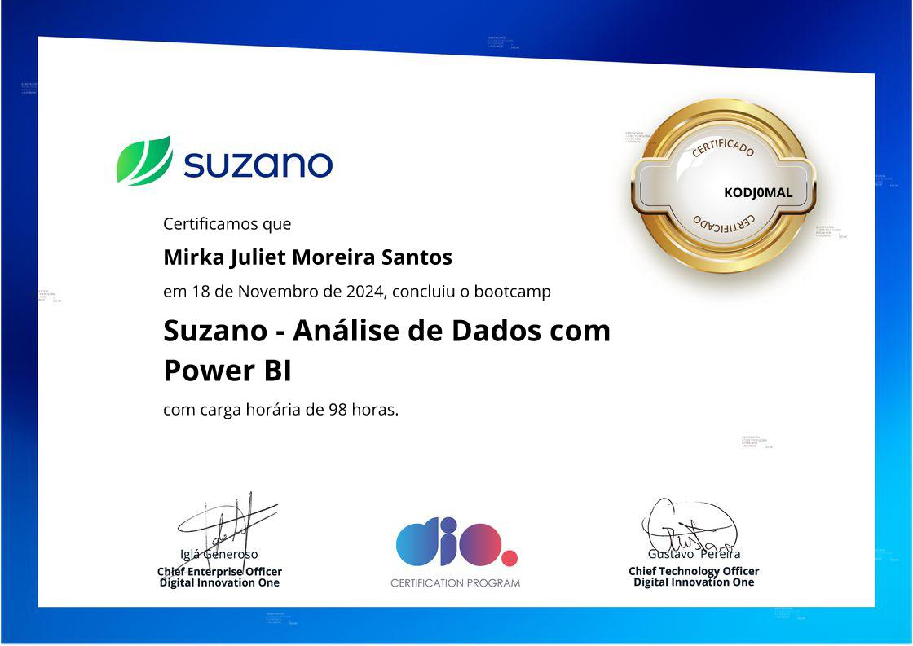

# 🎓 Bootcamp Análise de Dados com Power BI 📊

## 🚀 Sobre o Bootcamp

Este bootcamp foi uma imersão completa no universo da análise de dados e Business Intelligence (BI), com foco no uso do **Power BI** e ferramentas complementares como **SQL** e **Python**. O programa combinou teoria, prática e desafios reais para desenvolver competências essenciais em análise de dados e visualização interativa.

---

## 📚 **Tópicos Estudados**

### 🔹 **Banco de Dados e SQL**
- Sistemas de Gerenciamento de Banco de Dados (SGDBs);
- Modelagem de Dados e Arquitetura de Banco de Dados;
- Modelo Entidade-Relacionamento (ER) e Mapeamento Relacional;
- Queries SQL avançadas com funções, agrupamentos e join statements;
- Otimização de consultas SQL para desempenho.

### 🔹 **Business Intelligence (BI)**
- Fundamentos de BI: KPIs, métricas e storytelling com dados;
- Criação de Dashboards Interativos no Power BI;
- Modelagem Dimensional e Star Schema;
- Limpeza, transformação e visualização de dados no Power BI;
- Relatórios gerenciais e experiência do usuário.

### 🔹 **Análise e Visualização de Dados**
- Modelagem e visualização com Python e Power BI;
- Fundamentos teóricos sobre ETL (Extração, Transformação e Carga);
- DAX: Fórmulas e cálculos para dashboards;
- Trabalhando com storytelling e relatórios de impacto.

---

## 💼 **Projetos Realizados**

1. **Refinando um Projeto Conceitual de Banco de Dados - E-COMMERCE**  
2. **Construindo um Esquema Conceitual para Banco de Dados**  
3. **Construindo seu Primeiro Projeto Lógico de Banco de Dados do Zero**  
4. **Dashboard Corporativo com Integração com MySQL e Azure**  
5. **Dashboard de Vendas com Power BI (Star Schema)**  
6. **Modelagem de Dashboard de E-commerce com Fórmulas DAX**  
7. **Relatório Gerencial de Vendas e Lucros com Data Analytics**  
8. **Dashboard Interativo para Tomada de Decisão**  

---

## 🛠️ **Ferramentas e Tecnologias**

- **SQL**  
- **Power BI**  
- **Python**  
- **MySQL**  
- **Azure**  
- **DAX**  

---

## 🎯 **Habilidades Desenvolvidas**

- Modelagem e otimização de dados;
- Construção de relatórios e dashboards interativos;
- Análise de dados e storytelling com visualizações;
- Automação e manipulação de dados com Python;
- Trabalho em equipes ágeis.

---

## 🌟 **Aprendizados Chave**

Este bootcamp não foi apenas sobre aprender ferramentas, mas sobre desenvolver um mindset orientado por dados, pronto para resolver problemas reais e gerar insights valiosos para empresas e projetos.

---

### 📸 **Imagem do Bootcamp**
Clique no link abaixo para visualizar o banner:  

---

**#AnáliseDeDados #PowerBI #BusinessIntelligence #SQL #Python #DataAnalytics #ETL #StorytellingComDados #Inovação**
